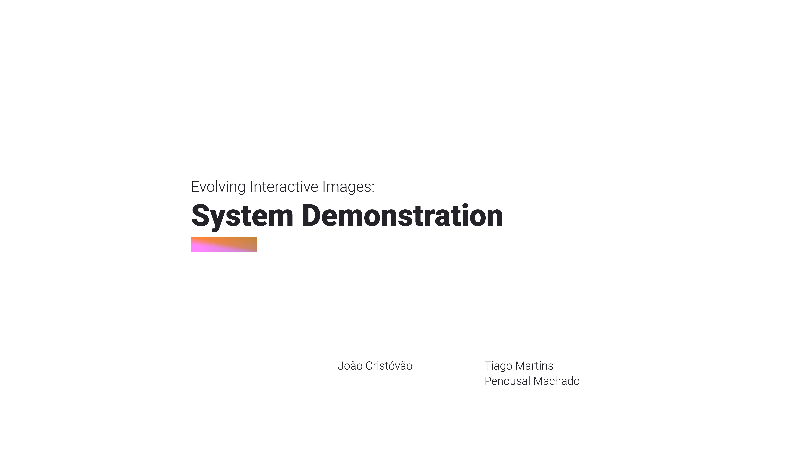
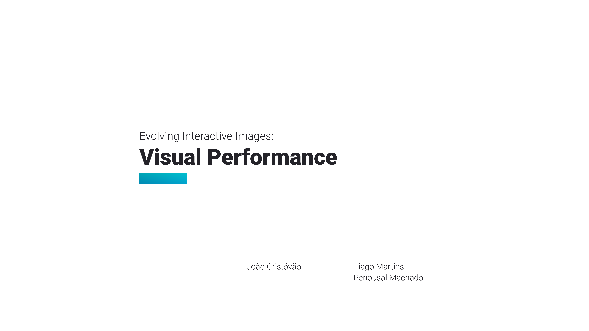
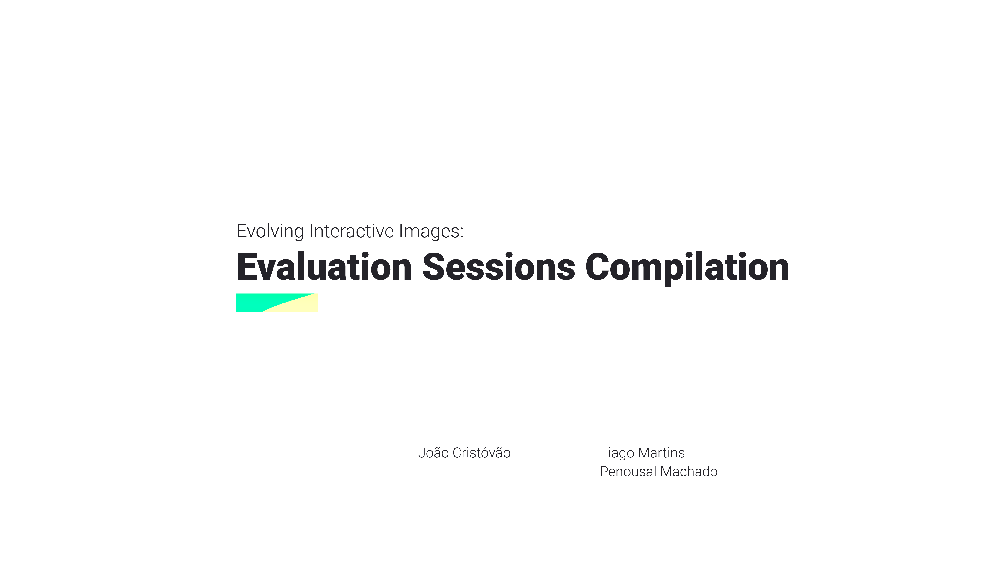
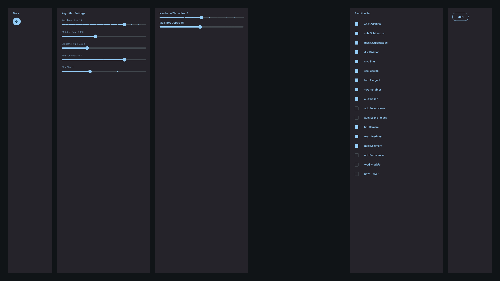
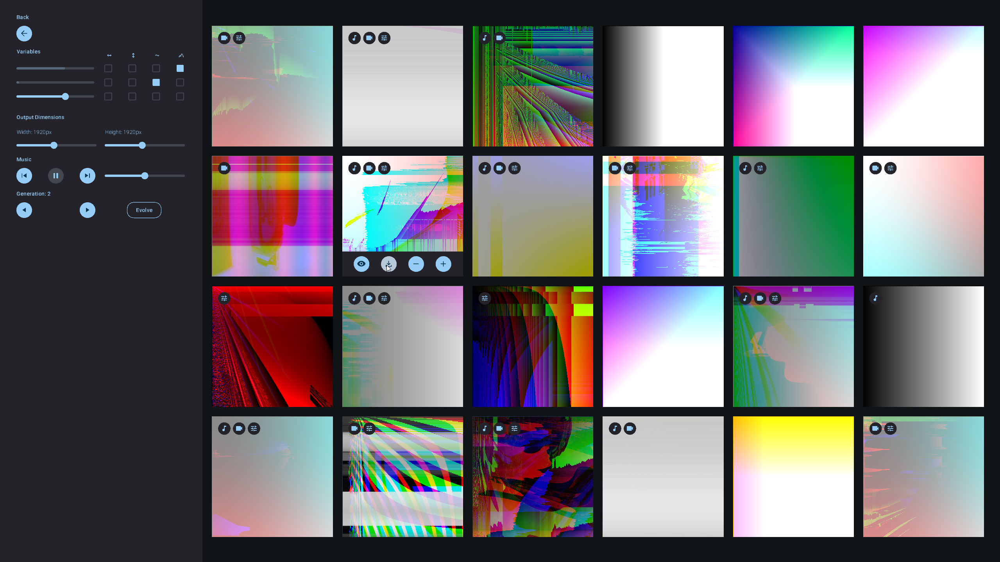
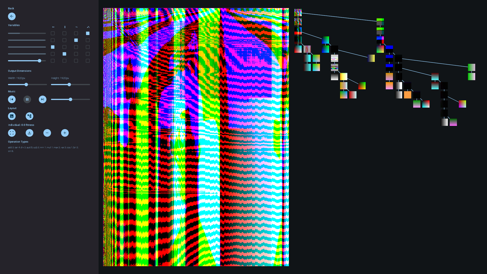
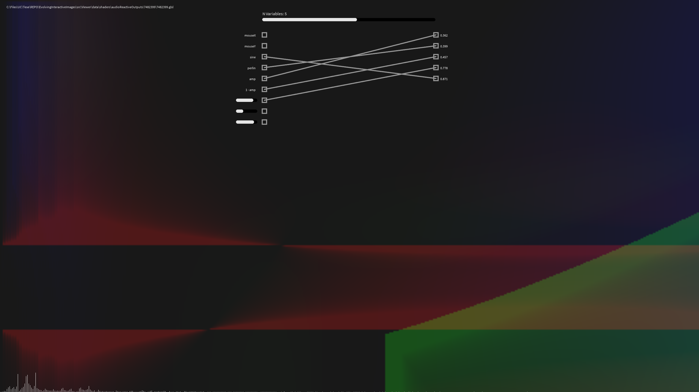
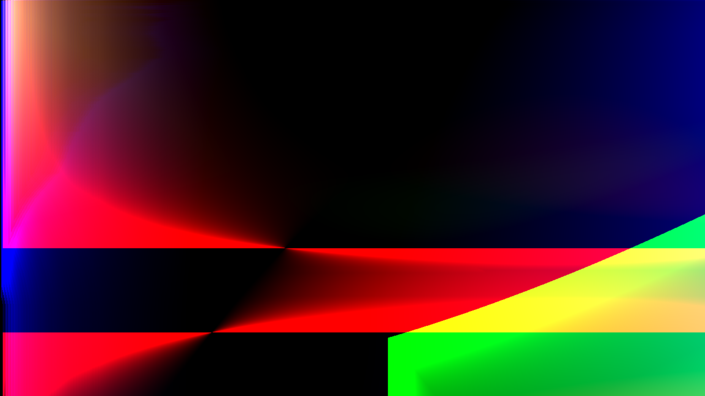

# EvolvingInteractiveImages

Repository dedicated to Master's Dissertation in Design and Multimedia at Department of Informatics Engineering, Coimbra. 

We have developed a system that generates interactive expression-based imagery, entirely in Processing.  
A Genetic Programming engine was created and put to use to create graphics along with shaders in OpenGL Shading Language.  
Interactivity is implemented by inputting information into outputs, such as image, sound or assorted data.  

Evolve your own imagery using *Evolver* and use it through *Viewer*.  
Or learn more about the system by following the provided *Modules*.

*This repository holds all the necessary software needed to run the developed system.*

## Watch the videos

[]()  


[](https://www.youtube.com/watch?v=_cYH_BOW8f8)  


[](https://youtu.be/OE8MPBrM1KE?si=NDAiZZutvx5NqRxL)  


## Prerequisites

- [ ] **Processing 4.2 installed**
  - Go to [download page](https://github.com/benfry/processing4/releases/tag/processing-1292-4.2);
  - Scroll down to Assets;
  - Download right option for your operating system;
  - Extract downloaded file.

- [ ] **Processing's Audio and Video Libraries:**
  - Go to extracted folder *processing-4.2*;
  - Open Processing.exe;
  - Go to Tools > Manage Tools;
  - Select Libraries Tab;
  - Search and install "Video Library for Processing 4" by the Processing Foundation;
  - Search and install "Sound" by the Processing Foundation.

## Content

### Modules

- **Description**: These modules introduce you to the system and progressively reveal its functionalities.
- **Location**:
  ```plaintext
  ├── src
  │   ├── Modules

### Evolver

Evolver is the core of the system. It is where you create your imagery. 

#### Location

- **Description**: Evolver is the core of the system. It is where you create your imagery.
- **Location**:
  ```plaintext
  ├── src
  │   ├── Evolver
  │   │   ├── Evolver.pde


#### GUI





### Viewer

- **Description**: Viewer is the program where you can visualize evolved imagery.
- **Instructions**: Drag the files of type  `.glsl` from folder `src > Evolver > outputs` into folder `src > viewer > shaders`.
- **Location**:
  ```plaintext
  ├── src
  │   ├── Viewer
  │   │   ├── Viewer.pde

#### GUI




## Known Errors

### Windows
- **Visual Bugs**: These may occur with the latest Processing Version (4.3). Use [Processing 4.2](https://github.com/benfry/processing4/releases/tag/processing-1292-4.2) instead.
- **Could not run the sketch (Target VM failed to initialize)**: Change the dedicated graphics card settings. [Follow this guide](https://pureinfotech.com/set-gpu-app-windows-10/). Apply the highest performance setting on the file *java.exe* found at *processing\processing-4.2-windows-x64\processing-4.2\java\bin\java.exe* in your machine.

### MacOS
- **Could not run the sketch (Target VM failed to initialize)**: Disabling the camera as input might solve this issue.
- **Could not compile shaders**: MacOS supports only older OpenGL versions, but shaders created on this system should work.

## Examples of static outputs

<div style="text-align: center;">
    
    
    
    
    
    
</div>

## Contributors

*Author:*  
João Maria Santos

*Supervisors:*  
Tiago Martins  
Penousal Machado

<br>

  
[](https://opensource.org/licenses/Apache-2.0)
