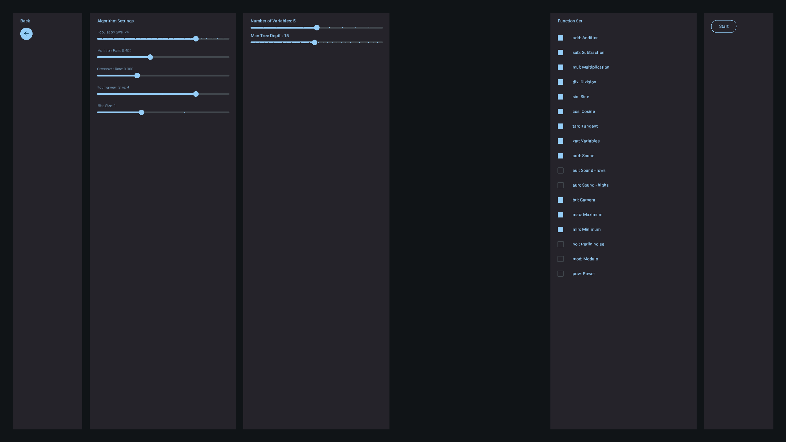
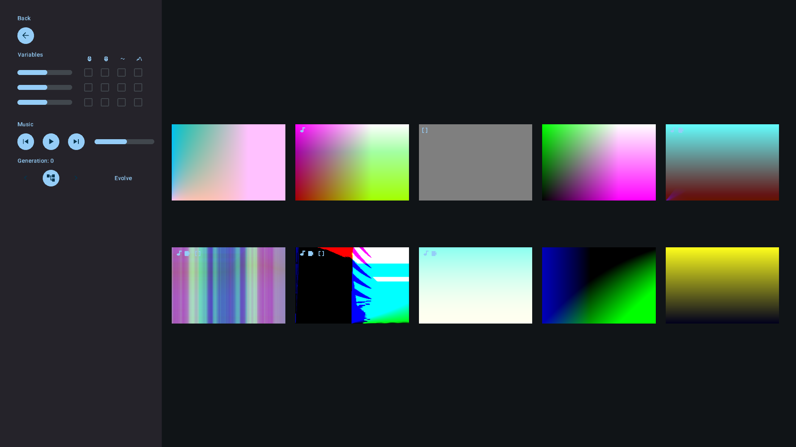
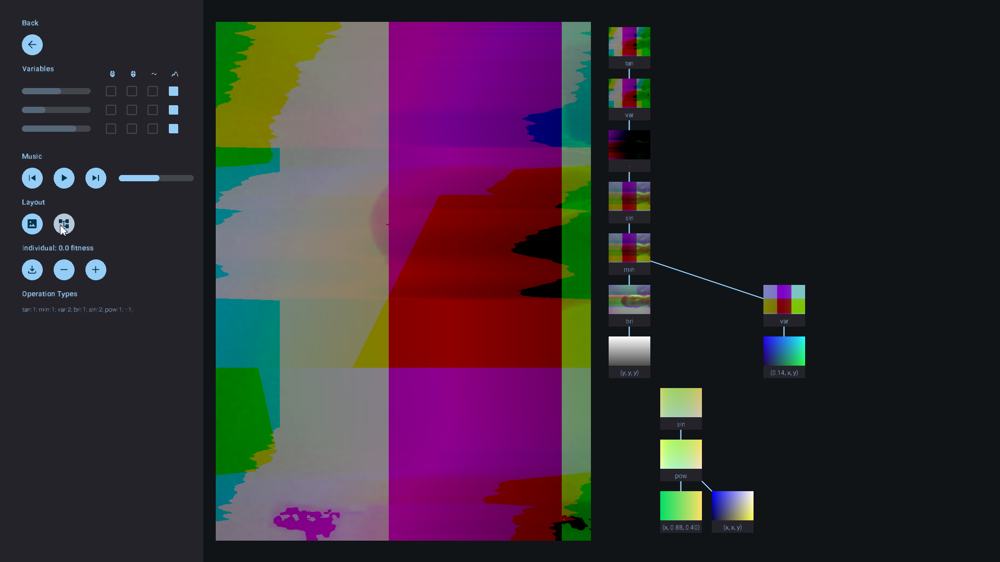

# EvolvingInteractiveImages
 
Repository dedicated to Master's Dissertation in Design and Multimedia @ FCTUC.

Objective of disseration is the creation of a tool capable of evolving interactive expression-based imagery.

This repository is a work in progress. Bugs may happen.

## Prerequisites

Lastest version of [Processing](https://processing.org/download) installed.

## Usage

There are two main programs: Evolver and Viewer.

### Evolver

Evolver is the program where you evolve imagery. Several iterations exist, they are numbered from earliest to newest in an ascending order. 

#### GUI

#### Location

<pre>
├── src
│   ├── Evolver
│   │   ├── Evolver.pde
</pre>

### Viewer

Viewer is the program where you can visualize evolved imagery.

#### Location

<pre>
├── src
│   ├── Viewer
│   │   ├── Viewer.pde
</pre>

## Examples of static outputs

## Contributors

Author:
João Maria Santos

Supervisers:
Tiago Martins
Penousal Machado
