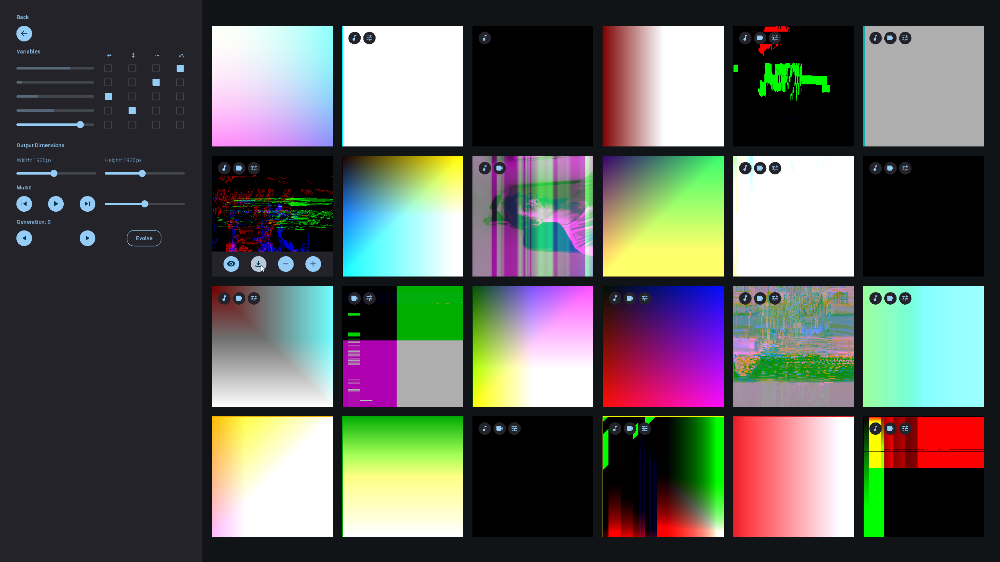

# EvolvingInteractiveImages

Repository dedicated to Master's Dissertation in Design and Multimedia @ FCTUC.

Objective of disseration is the creation of a tool capable of evolving interactive expression-based imagery.

This repository is a work in progress. Bugs may happen.

## Prerequisites

**[Processing 4.2](https://github.com/benfry/processing4/releases/tag/processing-1292-4.2) installed**

**Processing's Audio and Video Libraries:**
- Open Processing 4.2
- Go to Tools > Manage Tools
- Select Libraries Tab
- Search and install "Video Library for Processing 4" by the Processing Foundation
- Search "Sound" by the Processing Foundation

## Usage

There are two main programs: Evolver and Viewer.

### Evolver

Evolver is the program where you evolve imagery. Several iterations exist, they are numbered from earliest to newest in an ascending order.

#### GUI

#### Location

<pre>
├── src
│   ├── Evolver
│   │   ├── Evolver.pde
</pre>

### Viewer

Viewer is the program where you can visualize evolved imagery.

#### Location

<pre>
├── src
│   ├── Viewer
│   │   ├── Viewer.pde
</pre>

## Known Errors

**Visual Bugs**  
May happen when using latest Processing Version (4.3 at the time of writing). For that reason we recommend using [Processing 4.2](https://github.com/benfry/processing4/releases/tag/processing-1292-4.2)

**Could not run the sketch (Target VM failed to initialize)**  
Program crash with the mentioned error. It is a known bug in the Processing comunity. To fix this error you must change the dedicated graphics card when running Processing programs.  
To do so on Windows follow [this guide](https://pureinfotech.com/set-gpu-app-windows-10/). Apply the highest performance setting on the file *java.exe* found at *processing\processing-4.2-windows-x64\processing-4.2\java\bin\java.exe* in your machine.

## Examples of static outputs

## Contributors

Author:

João Maria Santos

Supervisers:

Tiago Martins

Penousal Machado
